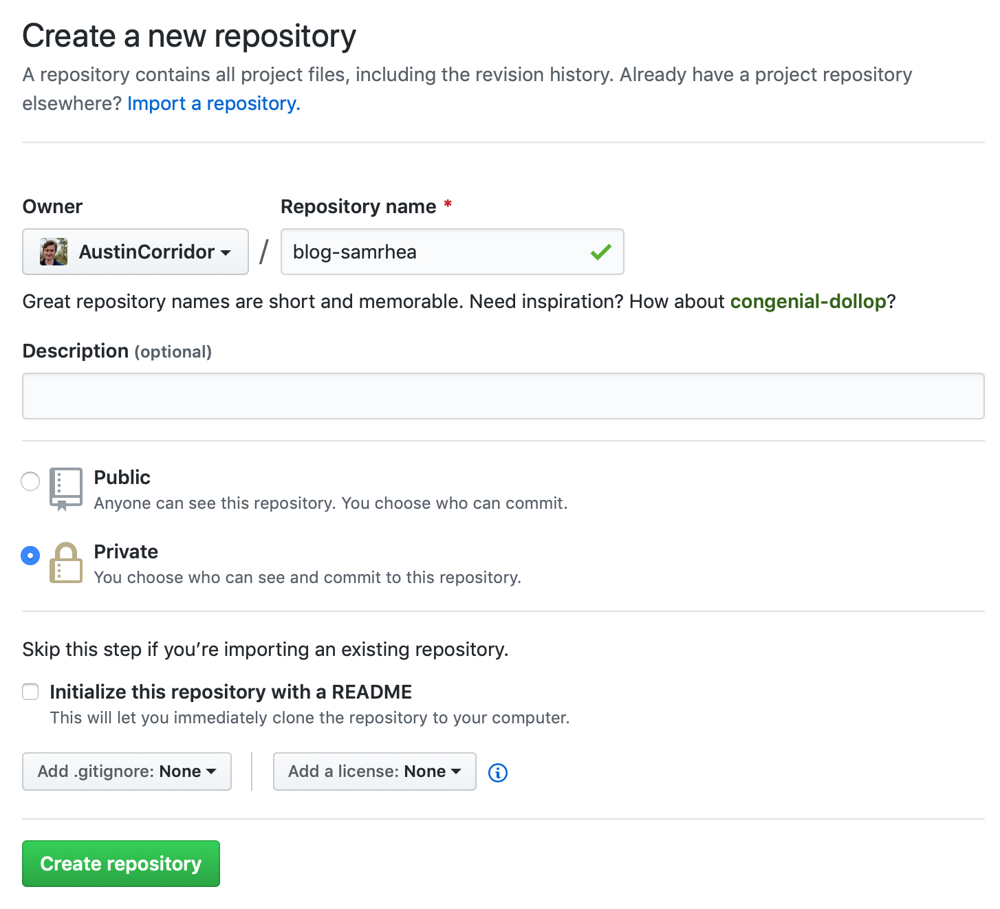
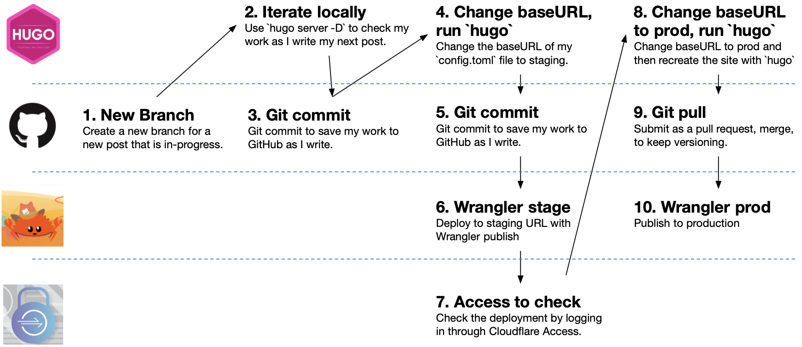

I converted this blog to [Workers Sites](https://workers.cloudflare.com/sites/) a couple weeks ago and wrote about it [here](https://blog.samrhea.com/post/wrangler-sites/). The initial setup was pretty bare bones. I saved the repository locally without any version control and deployed directly to production. No one gets paged if I break this blog, so that was fine.

However, I did receive some [questions](https://twitter.com/LakeAustinBlvd/status/1179057951597879298) on Twitter asking about how to integrate a deploy pipeline into this workflow. I decided to take some time this weekend and build out a staging flow and answer some of those questions. This work gave me an excuse to bring some maturity to this process, including a GitHub repo, which helps with situations like "what if I lose my laptop?"

Cloudflare Workers makes it easy to spin up a staging environment that mirrors production. I just need to deploy to a different subdomain. That deployment will use the same Workers and Workers KV stack as production and does not add any fixed cost to running the site since I don't need to spin up a separate VM. However, that does leave me with a site that is effectively public.

I need a way to lock it down. I work at Cloudflare as the Product Manager for [Cloudflare Access](https://www.cloudflare.com/products/cloudflare-access/), a product that can help entire enterprises replace their VPN or, for this personal blog, lock down a staging URL. With Access, I can control who can reach the staging site by prompting users, including myself, to login with an identity provider. I'm excited to bring what I work on into this pipeline.

I have a few goals for this project:

* Use GitHub for version control of my static site files
* Use [Wrangler](https://github.com/cloudflare/wrangler) environments for deploying to staging
* Use Cloudflare Access to secure staging

**⏲️Time to complete: ~1 hour (assuming you already completed the work in the last post).**

---

## Bringing GitHub to a static project

I have an admittedly quiet GitHub account. That said, the platform makes it easy to [create](https://help.github.com/en/articles/create-a-repo) a new repository; users can choose between public, which is shared to the world, or private. I'm going to keep the blog content repository private for the time being while I tune up this flow. To begin, I'll create a new repository in the GitHub UI.



### Git ignore

Before I push my files to that repository, I have some material that does not need to live in GitHub. I can use a `.gitignore` file to tell Git to exclude those files or folders.

```bash
blog-samrhea samrhea$ touch .gitignore
```

Inside of that file, I'm going to include the following paths:

```json
/themes/hugo-cactus-themes
/public
```

**Why?**

| Folder or File | Why exclude? |
|---|---|
| `/themes/hugo-cactus-themes` | This folder consists of the public theme I cloned for this project. The only modification I made was to replace my avatar image. |
| `/public` | Contains the output of my Hugo build, which changes whenever I run `hugo`. As long as I have the remaining files in this repository and Hugo, I can generate this at any time. |

### Configuration and first commit

I have an empty GitHub repository, but a pretty complete local repository. I now need to take the static site content, past and present, and push it to GitHub.

```bash
blog-samrhea samrhea$ git init
```

Initializes a Git project in my local repository

```bash
blog-samrhea samrhea$ git remote add origin https://github.com/AustinCorridor/blog-samrhea.git
```

Configures the Git project to use my GitHub repository

```bash
blog-samrhea samrhea$ git add .
```

Once I have created my project and added my remote origin, all of the local files I have that are not included in `.gitignore` look like changes. I need to stage all of these.

```bash
blog-samrhea samrhea$ git commit
```

Commits the entire set of changes, which in this case is the current local repository.

```bash
blog-samrhea samrhea$ git push -u origin master
```

Pushes the changes to the GitHub repository.

I can now visit the link and confirm that the Hugo files for my personal blog are saved to GitHub.


## Creating a staging environment

Hugo includes support to run a local web server of your project. The server updates each time you save a file, which makes it very convenient for reviewing changes in real-time in a browser alongside my text editor.

However, I also want to make sure that the Hugo output can be packaged and published by Wrangler to Cloudflare Workers without issue. To observe that, I want a real staging environment that mirrors production. In this case, the stack I need to mirror is Cloudflare and Cloudflare Workers. To get a staging environment, I need to deploy to the Internet. That gives me the benefit of running staging in the most equivalent setup to production possible. That opportunity also requires I find a way to limit who can reach staging, which I'll do in the second topic in this section.

### Wrangler environments

Wrangler [supports](https://github.com/cloudflare/wrangler/blob/master/docs/content/environments.md) deployment to multiple destinations using the `wrangler.toml` file and the commands you run. I'm going to create a new DNS entry in Cloudflare, "blog-staging.samrhea.com" that will serve as my staging environment. Now I need to tell Wrangler where staging lives. To do so, I'll change my `wrangler.toml` file by adding the block in `[env.staging]`.

```json
account_id = "CF_ACCOUNT_ID"
name = "blog-samrhea"
type = "webpack"
route = "blog.samrhea.com/*"
workers_dev = false
zone_id = "CF_ZONE_ID"

[env.staging]
name = "blog-staging"
route = "blog-staging.samrhea.com/*"

[site]
bucket = "public"
entry-point = "workers-site"
```

> **⚙️ Setting variables.**  In my current namespace, I set my zone ID and account ID variables by running `export CF_ZONE_ID="123"` and `expore CF_ACCOUNT_ID="456"`. With that set, I can keep my `wrangler.toml` file as it is above. I'll leave those lines here to reduce confusion, but with the variables set you can leave them out altogether.

Now, I can run the following commands to build my project and push those to Cloudflare:

```bash
blog-samrhea samrhea$ hugo
blog-samrhea samrhea$ wrangler publish --env staging
```

> **⚠️ Don't forget the Hugo base URL.**  In my `config.toml` file, I set a base URL for my project. When Hugo builds the site, it uses that to construct the links. This causes a problem when I want to preview my staging site since the links will take me to production. Instead, I need to update the baseURL value to the staging URL when I run `hugo` before publishing. This a clunky step; I'll try and remove it down the road.

When I visit "blog-staging.samrhea.com" I can see the output of my current work in an environment that matches production 1-1 because, beyond Hugo, the only stack I need to use includes Workers and Workers KV.

## Locking down staging with Cloudflare Access

Nothing I publish on this blog is confidential, but I do want to limit audience visibility into work-in-progress. Fortunately, Cloudflare offers a product that can protect subdomains or paths and only allow approved team members to reach them: Access.

Like I mentioned earlier, I'm the Product Manager for Access. I have written about Access on this blog [before](https://blog.samrhea.com/post/media-habits/), as well as on the Cloudflare [blog](https://blog.cloudflare.com/cloudflare-access-now-teams-of-any-size-can-turn-off-their-vpn/). I'll try to be succinct here. With Access, I can force any visitor to the staging URL of my blog to first authenticate. In this case, I'll just allow myself to view it, but I could add editors down the road.

[Access Policy](../../../static/media/post-images/deploy-pipeline/access-policy.png)

Now, when I visit "blog-staging.samrhea.com", I am presented with this prompt to login:

[Login](../../../static/media/post-images/deploy-pipeline/login.png)

I'll login with Google and, once authenticated, Access will redirect me to "blog-staging.samrhea.com". I can review the site as it will appear in production.

## The full picture

I now have the pieces for a full deployment pipeline. I've broken them out into the diagram below.



That pipeline gives me a contained staging environment that mirrors production and version control so I can save my work and track changes. Again, if a bad deploy took down this blog it wouldn't constitute an incident, but this workflow helps me prevent that and better manage the site.

## What's next?

Automation. The 10 steps in that list are _mostly_ manual. I want to get this down to one-click to staging and one-click to production. Most of that work is on the Hugo side with the baseURL requirement. I'll try to tackle that next.