The Portuguese immigration process loves paperwork. I purchased a printer for the first time in years when I moved here and, now that I have been here for a while, the scanner function does a lot of work converting stamped papers back to digital copies. That's fine and sometimes my brain prefers knowing that I can physically hold the original copies of my documents.

I still want a digital back-up though. I use iCloud for most things, but I'd like to have control over a redundant copy of those files. A USB drive isn't sufficient - I need to grab these (mostly PDF) files periodically from different locations, like when I'm standing in line at a SEF office, and I don't want to carry the drive with me.

Instead, I'm going to set up my own Samba server, move the files there, and connect to them when I need them. I still want the level of identity-driven control that a SaaS equivalent like iCloud or Google Drive offers me. Not only that, but I want to add redundant identity options in case one has an incident. This tutorial walks through how to use [Cloudflare for Teams](https://www.cloudflare.com/teams/) to accomplish all the above - at no cost with the free plan.

---

**🎯 I have a few goals for this project:**

* Deploy a Samba file server on an Ubuntu machine
* Make that machine inaccessible to the Internet
* Connect to that file server without adding back hauls that degrade performance
* Control who can reach the server using my identity provider of choise, instead of relying entirely on simple password auth in Samba

---

**🗺️ This walkthrough covers how to:**

* Deploy a Samba file server on an Ubuntu machine
* Use Cloudflare Tunnel to create a private network and connect that server to Cloudflare's network
* Connect to that server through Cloudflare's network using the WARP agent

**⏲️Time to complete: ~45 minutes**

---

> **👔 I work there.** I [work](https://www.linkedin.com/in/samrhea/) at Cloudflare. Several of my posts on this blog that discuss Cloudflare focus on building things with Cloudflare Workers. I'm a Workers customer and [pay](https://twitter.com/LakeAustinBlvd/status/1200380340382191617) my invoice to use it. However, this experiment uses products where I'm on the team (Access, Gateway, and Tunnel).

## Samba

The [Server Messaging Block](https://docs.microsoft.com/en-us/windows/win32/fileio/microsoft-smb-protocol-and-cifs-protocol-overview) (SMB) protocol provides connectivity from client device to file shares, printers, and other destinations. The vast majority of SMB use cases depend on Microsoft Windows.

What about the rest of the operating systems out there? 30 years ago, Andrew Trigdell [first built Samba](https://www.samba.org/samba/docs/10years.html) to provide for SMB connectivity from UNIX-like and BSD systems, like macOS. [Samba](https://www.samba.org/samba/docs/10years.html) is free, GNU-licensed, software and I'm going to run it on my Ubuntu machine and use the native Samba client on my Mac to connect.

I have an Ubuntu VM, running in Digital Ocean, where I'm going to run a Samba file server. You could repeat this process with other operating systems.

First, I'll install Samba using `apt`. I followed the directions available from Ubuntu [here](https://ubuntu.com/tutorials/install-and-configure-samba#1-overview
) with a couple of modifications beginning on step 3, which I'll call out here.

I have poor user hygiene and am running as root, so I created the Samba directory with this command.

```bash
mkdir /root/sambashare/
```

Next, I can edit the configuration of the Samba service.

```bash
sudo vim /etc/samba/smb.conf
```

I'll add the following five lines to the end of the configuration file.

```conf
[sambashare]
        comment = Samba on Ubuntu
        path = /root/sambashare
        read only = no
        browsable = yes
```

I can now add a user and set a password. I'll be relying on my identity provider login, but this password gives me an additional second factor if I want to think of it that way. Again, I'm running as root and Samba requires the user to also be a user on the machine, so I need to run the following command.

```sh
sudo smbpasswd -a root
```

Alright, I can now restart the service, update the firewall, and check its status.

```sh
sudo service smbd restart
sudo ufw allow samba
sudo service smbd status
```


Now that my Samba server is up and running, I need to connect to it. I do not want this service exposed to the public Internet, so I want to reach it through a private network. However, most private networks trust all users inside of them. I want to only let certain users in this private network reach this service (and no other services). To do that, I'm going to use Cloudflare Tunnel and Zero Trust network rules in Cloudflare Gateway.

## Cloudflare Tunnel

[Cloudflare Tunnel](https://www.cloudflare.com/products/tunnel/) connects applications, resources, and networks to Cloudflare's global network without requiring me to open up holes in my own firewall. The Cloudflare Tunnel daemon, `cloudflared`, will create outbound-only connections to Cloudflare. The daemon is [open-sourced](https://github.com/cloudflare/cloudflared) and [releases are available](https://github.com/cloudflare/cloudflared/releases) for several different operating systems.

Cloudflare Tunnel can be used for public-facing applications, [internal resources](https://developers.cloudflare.com/cloudflare-one/tutorials/share-new-site) that need Zero Trust rules, or in a deployment [similar to a private network](https://developers.cloudflare.com/cloudflare-one/tutorials/warp-to-tunnel), like what I'm doing in this tutorial.

### Install and Authenticate

First, I'm going to install `cloudflared`.

```sh
sudo wget https://bin.equinox.io/c/VdrWdbjqyF/cloudflared-stable-linux-amd64.deb
sudo dpkg -i ./cloudflared-stable-linux-amd64.deb
```

Next, I'll authenticate `cloudflared` into my Cloudflare account.

```sh
cloudflared login
```

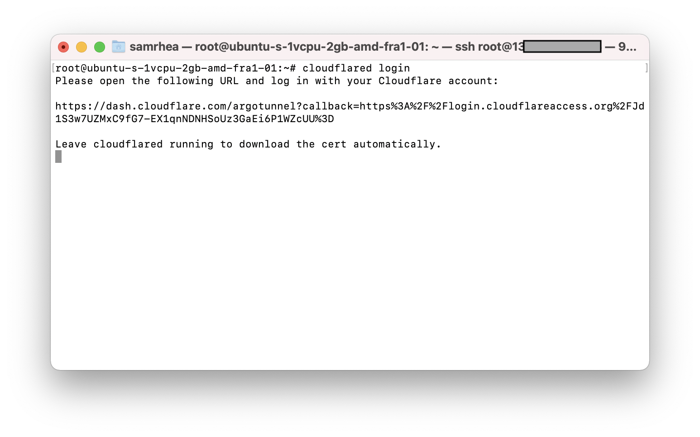

I'll follow that link in a browser, login to my Cloudflare account, and choose a site in my account. This part is a little clunky (and we're going to fix this) but I can pick any site listed for this private networking use case. The certificate downloaded will be account-wide.

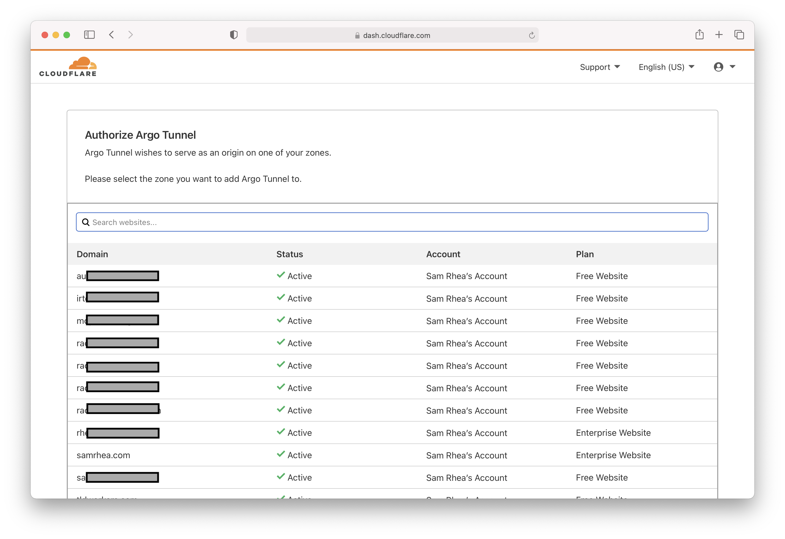

Once selected, I can return to my terminal and confirm that the instance of `cloudflared` has received the certificate.

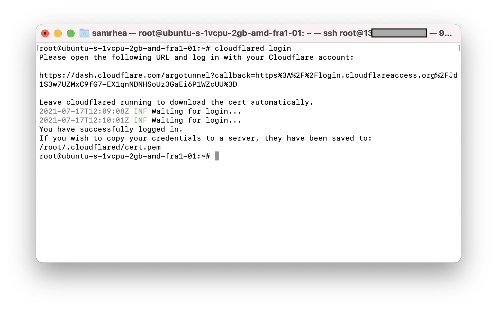

### Configure and Connect

Now that I have authenticated `cloudflared`, I can create my Tunnel. The following command will create a Cloudflare Tunnel - but it won't run it just yet, we'll do that after we configure it.

```sh
cloudflared tunnel create smb-machine
```

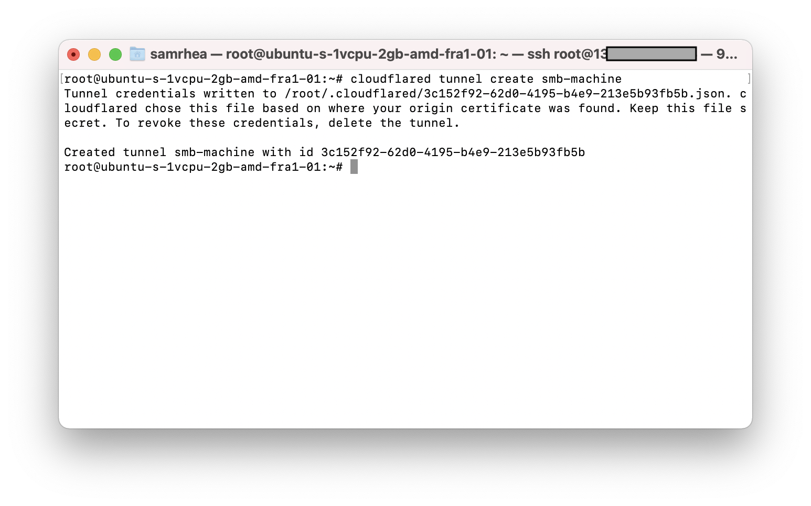

The command above created a Tunnel in my account and issued credentials for that Tunnel to this instance of `cloudflared`. The Tunnel I created is not ephemeral or dependent on `cloudflared` to be running. For example, when `cloudflared` restarts, I do not need to recreate this Tunnel.

Next, I am going to configure the private network functionality of Cloudflare Tunnel. The command below will tell Cloudflare to send traffic inside of my private network, bound for the specified IP CIDR, to the Tunnel I just created.

```sh
cloudflared tunnel route ip add 10.0.0.4/32 smb-machine
```

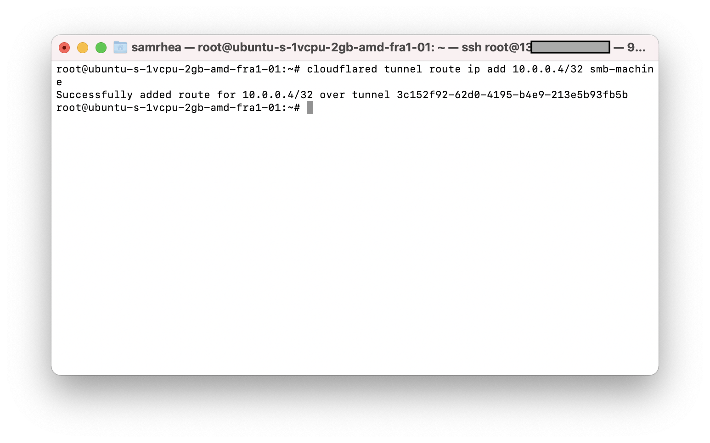

I can now finish configuring the Tunnel itself. I'm going to create a configuration file and edit it (in Vim) with the following command.

```sh
vim /root/.cloudflared/config.yaml
```


Inside of that file, I'll add the following lines. The `tunnel:` value is the ID of the Tunnel I created earlier and the `credentials-file:` value is the location of the credentials file for that Tunnel.

```yaml
tunnel: 3c152f92-62d0-4195-b4e9-213e5b93fb5b
credentials-file: /root/.cloudflared/3c152f92-62d0-4195-b4e9-213e5b93fb5b.json
warp-routing:
  enabled: true
```

I'm going to knock out one final step. You might notice that the Samba server is not listening on the IP address that I just configured. To handle that, I'm going to run the following command to configure my network interface to receive traffic for that IP. You might not need this step if your service is available at the IP you configured.

```sh
ifconfig lo:0 10.0.0.4 up
```

`ifconfig` commands do not survive a restart, so I'll go back later and make sure to add this to my `etc/network/interfaces` file, but for now this allows me to test.

### Run

Alright, I'm ready to run the Tunnel. I could run this Tunnel in a one-off way, to test the functionality, with the command below:

```sh
cloudflared tunnel run smb-machine
```

However, I want access to this file server even if `cloudflared` or the Ubuntu machine restarts, so I'm going to run `cloudflared` [as a service](https://developers.cloudflare.com/cloudflare-one/connections/connect-apps/run-tunnel/run-as-service).

```sh
sudo cloudflared service install
sudo systemctl enable cloudflared
```

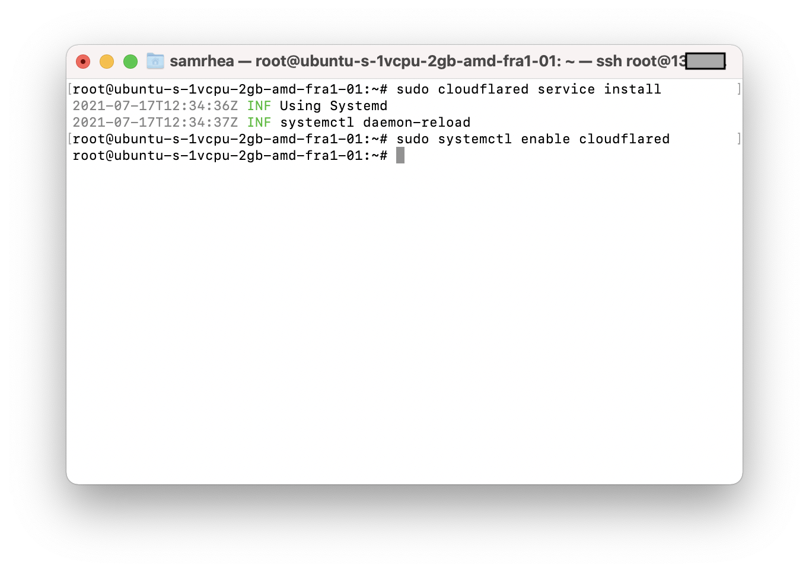

With that, `cloudflared` is now connected to Cloudflare's network, ready to receive traffic bound for `10.0.0.4/32`, and able to survive a restart.

## Building Zero Trust rules

The only users able to connect to that private IP will have to first enroll in my account. I can control who can enroll in my account (more on that later), but imagine I am part of a large organization. I don't want just anyone in that organization to be able to reach this resource.

I'm going to build a rule that only allows me to connect. I could modify this to allow users in a specific Okta group or a list of users, but in this case it's just me.

To create that rule, I'll navigate to the [Cloudflare for Teams dashboard](https://dash.teams.cloudflare.com). In the dashboard, I'm going to open the `Gateway` page and find the `Network` tab.


First, I'll create a rule to allow my user identity to reach the IP specified.


Next, I'm going to create a second rule to block everyone else.

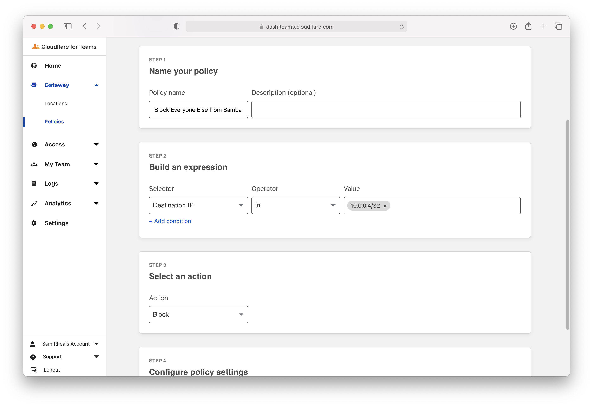

These rules are enforced in top-to-bottom order, so I need to make sure the Allow rule is listed first.

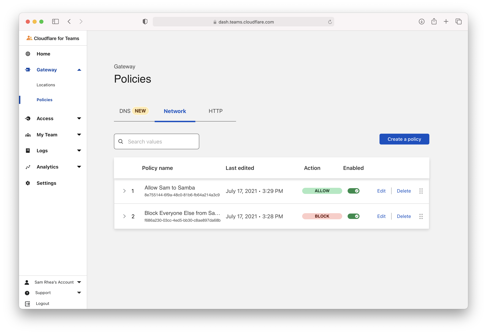

## Connecting from WARP

I can now enroll my client machine into this private network and connect to the Samba server.

### Configuring enrollment

First, I need to define who can enroll into my private network using the WARP agent. To do that, I'm going to stay in the Cloudflare for Teams dashboard and open the `Settings` page.

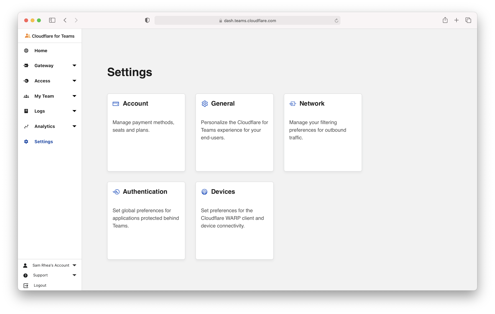

I'll select `Device` settings.

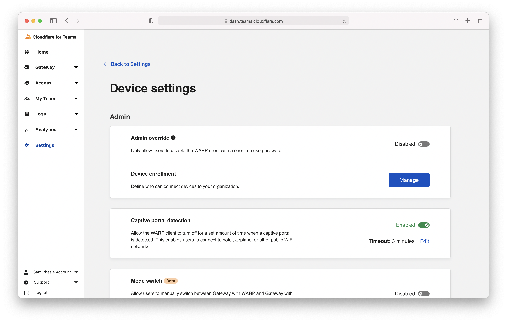

I'll configure the enrollment rules by clicking **Manage**. I already have configured a handful of identity providers, but if you haven't yet then [this guide](https://developers.cloudflare.com/cloudflare-one/identity) will help you get started.

I'm going to only allow myself to enroll, but I could add rules to allow my entire team, identity provider groups, or even users from multiple identity providers.

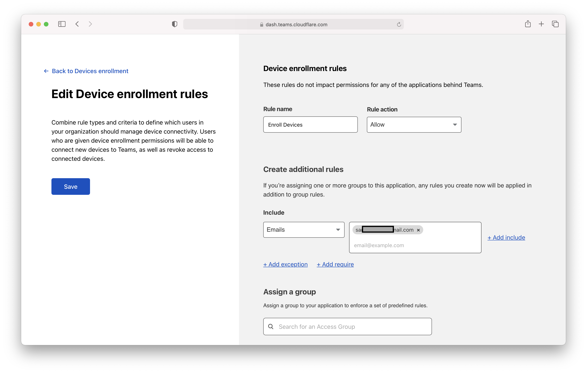

Once saved, I can leave this page and configure my account's network settings.

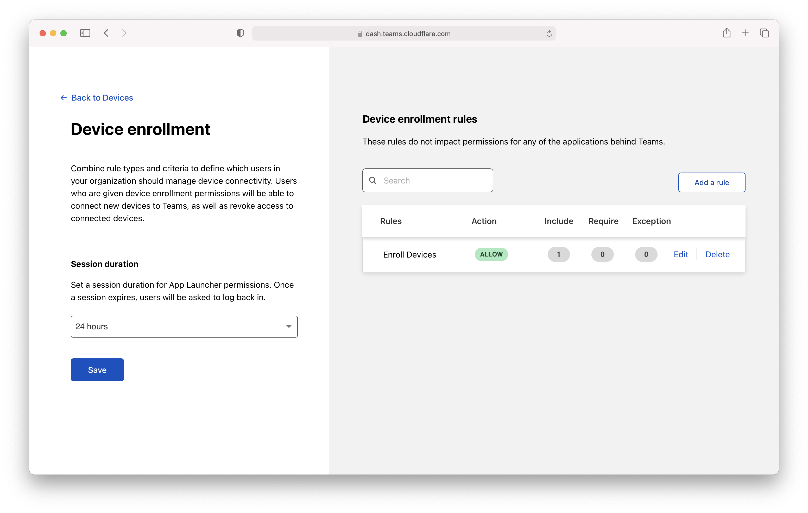

### Configuring my network

Second, I need to configure the settings that will be applied when users enroll. I'll stay in the `Settings` page, but navigate over to the `Network` section. In this case, I need to make sure that `TLS inspection` and the `Proxy` mode settings are both enabled.


One last thing here - the WARP agent, which is going to be my on-ramp to connect to this resource, excludes a list of private IP ranges by default. I need to [delete any ranges](https://developers.cloudflare.com/cloudflare-one/connections/connect-devices/warp/exclude-traffic) that include the IP I configured previously.

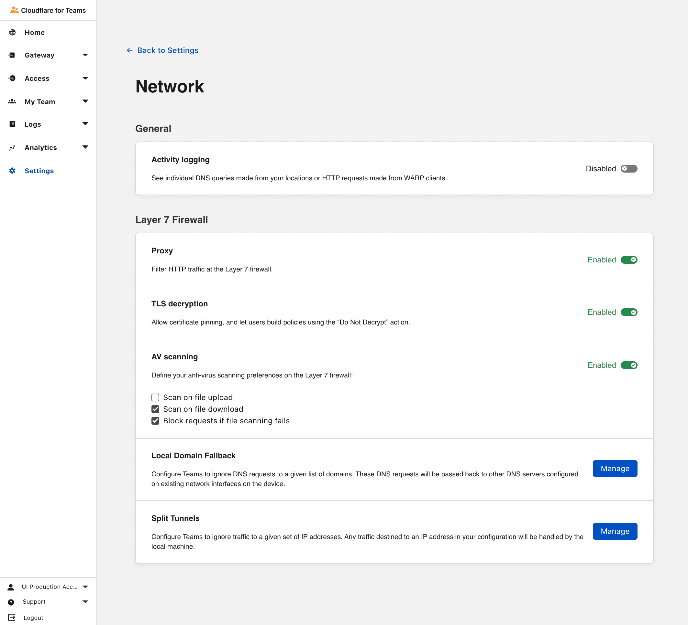

### Enrolling my device

I'll begin the third step by adding a certificate to my device. I'll navigate to the `Certificates` card of the `Devices` page in the `Settings` section to download the certificate, then I'll follow [these instructions](https://developers.cloudflare.com/cloudflare-one/connections/connect-devices/warp/install-cloudflare-cert) to add the certificate to my machine.

> The WARP agent, and this private routing use case, can work alongside Cloudflare's Secure Web Gateway, which performs traffic inspection using the certificate installed above. We're going to make this easier and remove this requirement for purely private routing use cases.

I can now download the WARP agent (links are available in the same Device settings page).

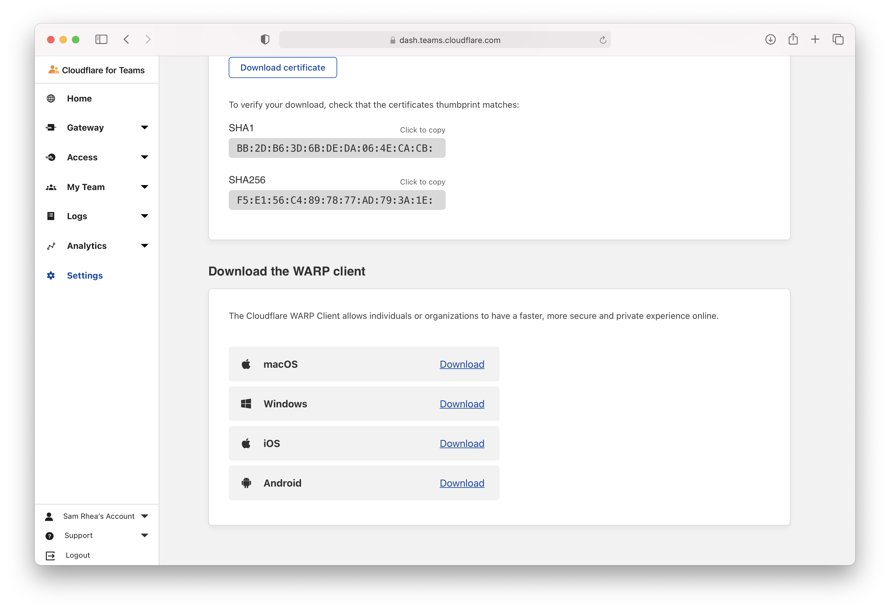

Once installed, I need to enroll the agent into my Cloudflare account.

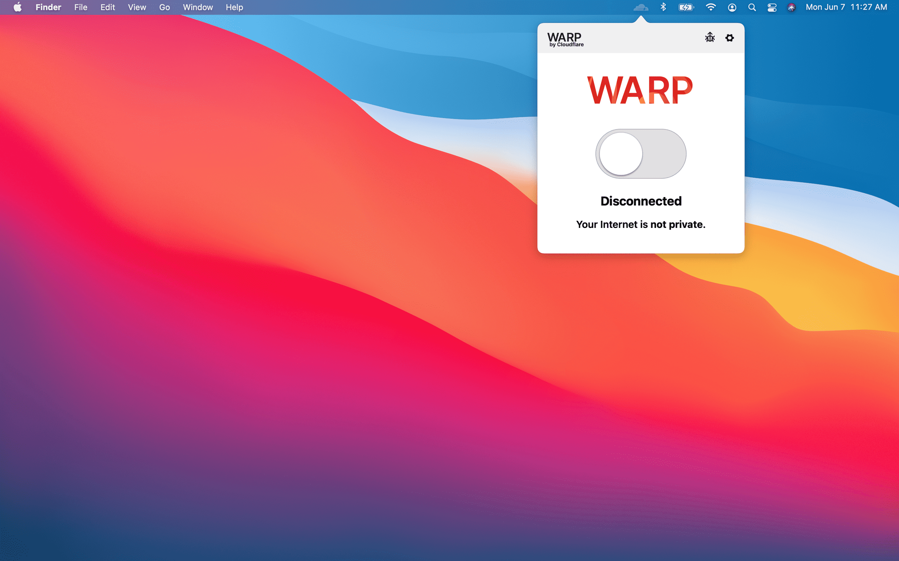

To do so, I'll click the gear icon and navigate to the Account view.

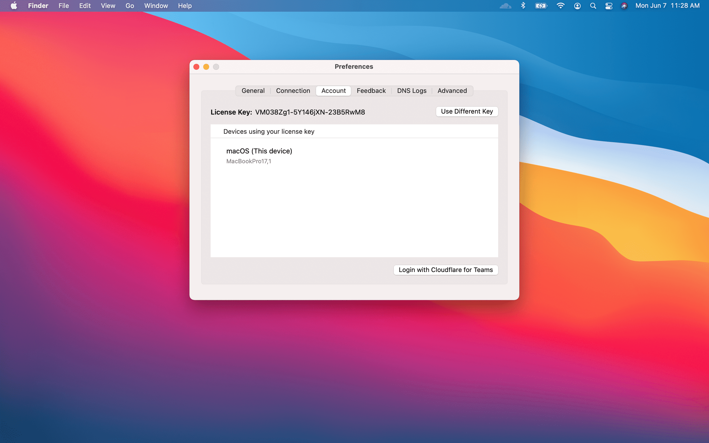

I'm going to input my Cloudflare for Teams name; if you don't remember this value, you can find it in the `General` page of the `Settings` section. Once entered, I'll be prompted to authenticate with my identity provider.


Finally, I need to make sure the agent is running in "WARP" mode - the proxy version - rather than just DNS mode.

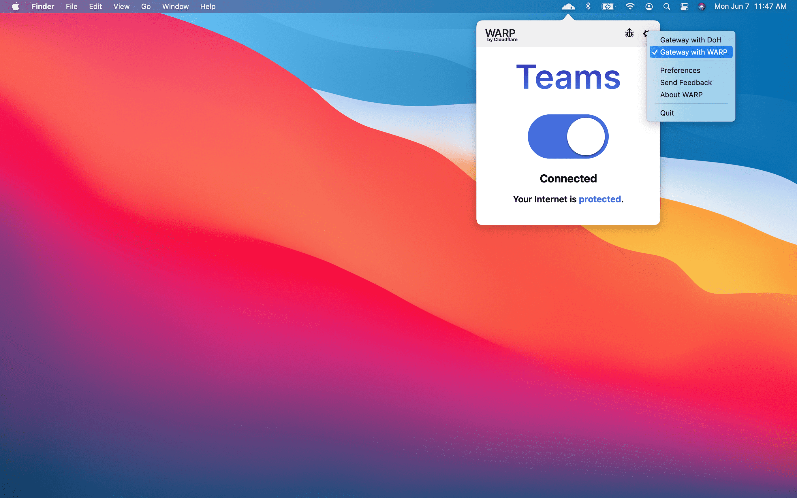

> For large organizations, these steps can be completed via an MDM deployment to avoid requiring users to manually complete them.

## Connecting to the Server

With WARP enabled, I can now connect to the Samba share for my device. I'll input the IP of the resource.


I'll authenticate with the credentials created earlier.


And I'm connected! Behind the scenes, Cloudflare checked that my user identity (stored in WARP) is allowed to reach this IP and connected me through.


## What's next?

I like this. I now have a private file storage that doesn't rely on any one consumer-focused service. I can also keep my device safe by adding [Secure Web Gateway or DNS filtering](https://developers.cloudflare.com/cloudflare-one/policies/filtering) rules with just a few clicks. I can access it from any location (and even see logs).


That said, a few of these steps could be consolidated and easier (or removed for this specific use case). We're going to work on that next. I'm also going to move the Samba server to a machine I run in a safe location.

> **Don't forget your public IPs** The goal of this setup is that nothing is exposed to the Internet; I'm going to configure my Droplet to block inbound connections to its public IP. If I need to reach it again, I'll use the [SSH functionality](https://developers.cloudflare.com/cloudflare-one/tutorials/ssh-browser) of Cloudflare Tunnel.